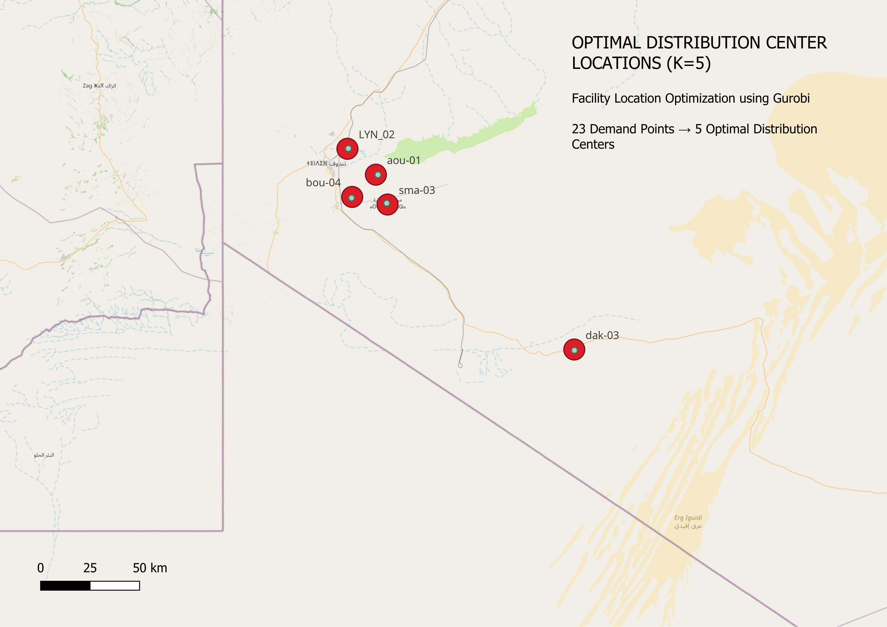
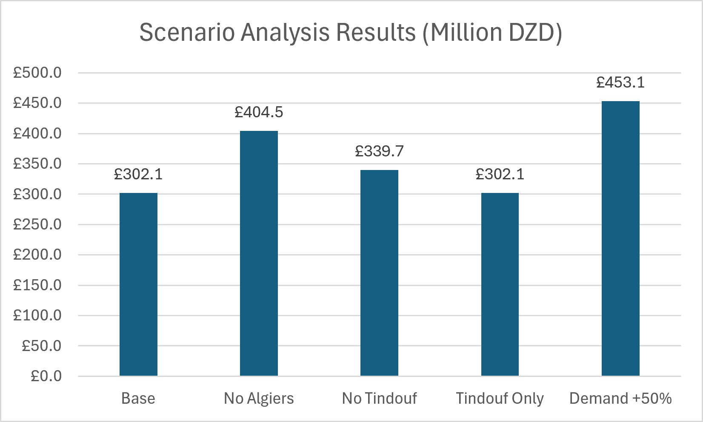

# Humanitarian Food Supply Chain Optimization for Sahrawi Refugee Camps

## Project Workflow

Data Collection  
→ Demand Estimation  
→ Facility Location Optimization  
→ Market Selection  
→ Transportation Cost Analysis  
→ Warehouse Network Design  
→ Resilience Scenario Analysis

## Network Visualization



## Overview

This project develops a humanitarian food supply chain optimization framework for Sahrawi refugee camps located near Tindouf, Algeria.

The objective is to design a resilient and cost-efficient food distribution network by integrating operations research, GIS analysis, procurement planning, transportation modeling, and scenario analysis.

## Components

- Facility Location Optimization
- Procurement Optimization
- Transportation Cost Analysis
- Warehouse Network Design
- Supply Chain Resilience Analysis
- GIS-Based Network Mapping

## Tools

- Python
- Gurobi
- SQL Server
- QGIS
- Tableau
- Excel

## Key Results

### Facility Location

Five optimal distribution centers were selected from 23 candidate demand points.

### Procurement Strategy

- Algiers: Rice, Lentils
- Tindouf: Oil, Sugar, Wheat Flour

### Cost Structure

| Cost Component | Value (DZD) |
|----------------|------------:|
| Purchase Cost | 302,064,000 |
| Transportation Cost | 53,507,310 |
| Total System Cost | 355,571,310 |

### Scenario Analysis



| Scenario | Total System Cost (DZD) |
|----------|------------------------:|
| Current Network | 355.6 M |
| No Algiers Market | 408.8 M |
| No Tindouf Market | 391.6 M |
| Only Tindouf Central Warehouse | 357.0 M |
| Demand +50% | 533.4 M |

## Repository Structure

```text
data/
results/
src/
maps/
README.md
```

## Main Output Files

### Data

- CandidateLocations.csv
- DemandPoints_Final.csv
- FoodPrices_Standardized.csv
- Markets.csv
- MonthlyFoodDemand.csv
- Warehouses.csv

### Results

- DistanceMatrix.csv
- FacilityLocationSummary.csv
- OptimalMarketSelection.csv
- ResilienceSummary.csv
- TotalLandedCost.csv
- WarehouseNetworkSummary.csv

### Source Code

- facility_location_pipeline.py
- select_optimal_market.py
- resilient_market_selection.py
- calculate_food_purchase_cost.py
- generate_market_camp_distance.py
- calculate_total_landed_cost.py
- warehouse_network_design.py
- scenario_analysis.py
- resilience_analysis.py
- generate_monthly_food_demand.py

## Author

Mahmoud El Baillal

Industrial Engineering Student  
Yildiz Technical University

## Future Improvements

- Multi-period inventory optimization
- Vehicle routing optimization
- Stochastic demand modeling
- Humanitarian emergency response scenarios
- Real-time GIS integration


## Connect

LinkedIn:
https://www.linkedin.com/in/mahmoud-el-baillal

GitHub:
https://github.com/mahmoudelbaillal62-create
